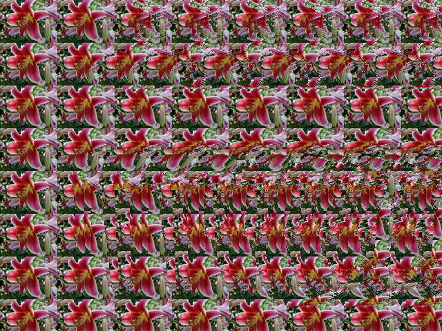

# OpenStereogram for Processing

This code is a conversion of OpenStereogram for Java desktop to the Processing language development and SDK.

Original Project: http://gfcaprojects.googlepages.com/openstereogram

Original Project Code: https://code.google.com/archive/p/openstereogram/

License: https://opensource.org/licenses/BSD-3-Clause

